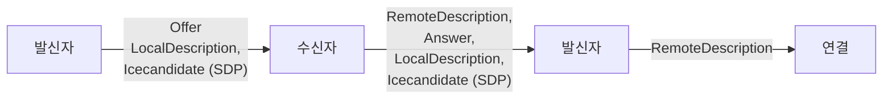
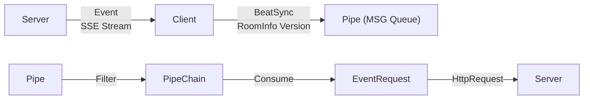
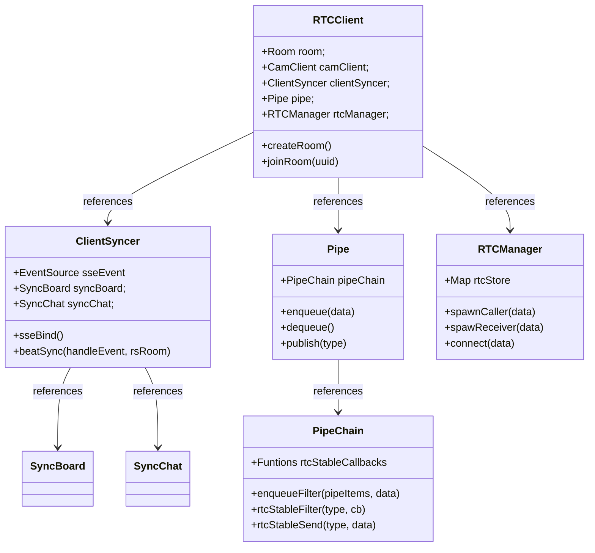

# 스터디 클럽 WEB-RTC


## 📝 프로젝트 개요
Web에서 N:N 다수의 사용자들과 화상 통화를 진행하거나,
연결된 P2P 데이터 채널을 통해 데이터를 교환하여 채팅 및 공용 보드의 낙서나 사진을 동기화합니다.
WebRTC 연결 과정을 NodeJs, Socket이 아닌 Http 메시지로 핸들링하고 싶었으며,
이벤트 지향성으로 확장성을 고려하여 시그널링 서버 및 클라이언를 맡았습니다.


## 🧩 프로젝트 의도 및 이점
### 스터디 클럽 WEB-RTC
- Web RTC를 알게 되어 흥미로운 기술이라고 생각하고, N:N 연결을 시도해 보았습니다.
- NodeJS 및 WebSocket을 사용하지 않고, HTTP 메시지 핸들링만으로 연결을 시도해 보았습니다.
- 리액티브 프로그래밍 이벤트 구독 발행 모델을 모방하여, 메시지 큐와 이벤트를 활용한 확장성 있는 구조를 의도해 보았습니다.
- 손쉬운 방 생성, 방 입장 API를 통해 프로젝트에 손 쉽게 부착하였습니다.

## 🛠️ 사용 기술
- 기술
  - JAVA
  - JAVASCRIPT
  - SPRING
- 라이브러리
  - WEB RTC
  
## 🔍 프로젝트 살펴보기
### RTC 시연
https://github.com/user-attachments/assets/279e2cb9-9a5c-4d94-b78a-3d664af47a20
- WebRTC 두 클라이언트의 P2P연결 후 화면입니다.
데이터 채널을 통해 채팅 및
캔버스 메타 데이터를 전달 받으며
드로잉 선 & 커서 & 이미지 파일들을 동기화합니다.
<br><br>

https://github.com/user-attachments/assets/67b81f44-1052-477f-8bb1-bb47fd83699c
- N:N 다수의 WebRTC 연결 모습입니다.
<br><br>

## 📋 구현 기능 
- 시그널링 서버
  - 이벤트 스트림 등록 API : SSE Event (Server Sent Event), 이벤트 핸들 API
  - 방 생성 API & 방 입장 API
  - 방 조회 API & 다수 방 조회 API
- 클라이언트
  - Web RTC N:N 연결 및 연결 후 P2P 데이터 채널을 통한
  - 화상 연결 & 채팅
- 캔버스 동기화 : 선 그리기, 선 색 변경, 화면 커서, 화면 지우기, 사진 객체
  - 백 버퍼 캔버스
- 방 버전 체크
- 이벤트 파이프라인
  
## 📝 WEB RTC SERVER 다이어그램
### WEB RTC 프로세스 플로우
- 발신자가 Offer 생성 및 로컬 정보 설정 시 발신자의 네트워크 후보들이 SDP인증서에 등록됩니다.
- 수신자는 발신자의 Offer를 수신하고, 원격 정보 설정 이후 Offer기반 Answer응답을 생성합니다.
- 이후 수신자는 마찬가지로 로컬 정보 설정 시 수신자의 네트워크 후보들이 SDP인증서에 등록되며,
- 이하 발신자가 SDP 인증서가 담긴 Answer를 응답받고 원격 정보 설정 시,
- 둘은 Connected 상태로 전환 되며, P2P 연결 상태가 됩니다.



### 흐름도 이미지 (서버)


#### SSEService
- SSEController를 통해 클라이언트에 SSEEvent 스트림을 등록합니다.
EventCapture를 통한 결과를 서버에서 클라이언트에게 메시지를 발송할 수 있게 됩니다.
  - autowire
  - EventCapture 구현체들을 의존 주입합니다.
  - OfferEvent구현체는 Offer, AnswerEvent구현체는 Answer.
    이벤트와 매칭 됩니다. 사용자에 의거 EventCapture 클래스가 확장 되어도,
    기존 코드를 수정 하지 않도록 Spring 의존 주입을 활용해 보았습니다.
     ```java
      @Service
      public class SSEService {
      
          private Map< String, Map< String, SseEmitter > > roomClientEmitters 
              = new ConcurrentHashMap<>();
          private Map< String, EventCapture > eventCaptureStore 
              = new ConcurrentHashMap<>();
      
          @Autowired
          SSEService(List< EventCapture > eventCaptures){
              eventCaptures.forEach(ec -> eventCaptureStore.put(getEventType(ec), ec));
          }
      
          private String getEventType(EventCapture eventCapture){
              String simpleName = eventCapture.getClass().getSimpleName().toLowerCase();
              int index = simpleName.indexOf("event");
              return simpleName.substring(0, index);
          }
      }

     @Component
      public class OfferEvent implements EventCapture{
          .
          .
          .
      }
    
      @Component
      public class AnswerEvent implements EventCapture{
          .
          .
          .
      }
     ```
  - publish
  - 클라이언트로부터 요청받은 HandleEvent를 발행합니다.
    클라이언트들을 순회 하며, EventCapture가 적합한 Event를 처리하여,
    클라이언트들에게 전달합니다.
  - 책임 및 처리를 EventCapture로 위임시켜,
    이벤트 확장에도 코드 수정이 없도록 디자인해보았습니다.
     ```java
      public void publish(HandleEvent handleEvent){
        .
        .
        Map clients = roomClientEmitters.get(roomUuid);
        clients.forEach( (targetClient, emitter) ->{
            doPublish(targetClient, handleEvent, emitter, clients);
        });
    }

    private void doPublish(String targetClient, HandleEvent handleEvent, 
        SseEmitter emitter, Map< String, SseEmitter > clients){

        String eventType = handleEvent.getEventType();

        if( eventCaptureStore.containsKey(eventType) ){
            EventCapture eventCapture = eventCaptureStore.get(eventType);
            eventCapture.doAction(targetClient, handleEvent, (data) ->{
                try {
                    emitter.send(data, MediaType.APPLICATION_JSON);
                } catch (IOException e) {
                    .
                    .
                }
            });
        }
    }
     ```
#### EventCapture
  - Event를 적합하게 처리할 인터페이스입니다.
  적합 구현체가 그 역할을 구현합니다.
    - JoinEvent
    - EventCapture 구현한 JoinEvent입니다.
      Join 발생 시 요청 클라이언트를 제외한 모든 클라이언트에게 메시지를 발송합니다.
       ```java
        @Component
        public class JoinEvent implements EventCapture{
        
            private final RoomService roomService;
        
            @Autowired
            public JoinEvent(RoomService roomService){
                this.roomService = roomService;
            }
        
            @Override
            public void doAction(String targetClient, HandleEvent handleEvent, 
                Consumer< RoomStateEventHandler > consumer) {
        
                if(!targetClient.equals(handleEvent.getClientUuid())){
  
                    HandleEvent data = new HandleEvent(handleEvent);
                    Room room = 
                        roomService.getRoomStore().get( handleEvent.getRoomUuid() );
        
                    RoomStateEventHandler roomStateEventHandler = 
                        new RoomStateEventHandler(room, data);
                    consumer.accept(roomStateEventHandler);
                }
            }
        }
       ```
## 📝 WEB RTC CLINET 다이어그램
### 프로세스 플로우
- 서버로부터 Event를 받으면 BeatSync를 통해 방에 대한 정보 및 버전을 업데이트합니다.
- 해당 이벤트를 MsgQueue Pipe에 발행합니다.
- Pipe는 PipeChain으로 부터 진입 시 필터를 거치고 발행 시 특정 로직을 처리하며,
- 처리 결과가 시그널링 서버로 전송됩니다.



### 흐름도 이미지 (클라이언트)


### 클래스 구조



#### ClientSyncer
- 서버와 이벤트를 송수신하여 클라이언트들과 동기화를 처리하는 클래스입니다.
또한 Web RTC가 연결되어 P2P상태에 돌입 되었을 때에도 DataChanell을 통해 동기성을 처리합니다.
  - sseBind
  - Event Stream 콜백 및 DataChanell 콜백을 설정 합니다.
    Event는 비트 싱크로 향하며,
    P2P DataChanell Msg SyncBoard 및 SyncChat이 사용합니다.
     ```javascript
        sseBind(rs){
            .
            .
            .

            this._eventSource = new EventSource(path);
            this._eventSource.onmessage = (e) =>{
                const roomStateEventHandler = JSON.parse(e.data);
                this.heartbeatSyncStatus(roomStateEventHandler.handleEvent, roomStateEventHandler.room);
            }
    
            this._rtcManager.msgReceiver = (event) =>{
                const receivedBuffer = event.data;
                const receivedString = new TextDecoder().decode(receivedBuffer);
                const receivedObj = JSON.parse(receivedString);
                this._SyncBoard.receive(receivedObj);
                this._SyncChat.receive(receivedObj);
            }

        }
    ```    
  - heartbeatSyncStatus
  - 서버의 룸 정보 및 이벤트에 의거 적합한 이벤트를 Pipe로 발행합니다.
     ```javascript
       heartbeatSyncStatus(handleEvent, rsRoom){
          .
          .
          .
          if(room.lastModified < rsRoom.lastModified){
    
              if(eventType === "join"){
                  this.syncJoin(rsRoom);
              }
    
              this._rtcClient.updateBeatSync(rsRoom);
          }
          else if(room.lastModified === rsRoom.lastModified){
              if(eventType === "offer"){
                  this.syncHandleOffer(handleEvent)
              }
    
              if(eventType === "answer"){
                  this.syncHandleAnswer(handleEvent)
              }
          }
    
      }
                          
                              
    
      syncJoin(rsRoom){
          .
          .
          for(let it of Object.values(rsRoom.camClients)){
              const target = it;
              if(camIndex < target.index){
                  const data = { type : "offer", target : target.clientUuid, sdp : ""};
                  pipe.enqueue(data);
              }
          }
          pipe.publish("offer");
      }
    ```
#### RTCClient
- RTC Client의 진입점 및 여러 객체를 관리하는 클래스입니다.
파이프라인을 정의하기도 합니다.
  - preCreatePipeLine
  - RTC Manager에 발신자 혹은 수신자를 요청하거나,
    이벤트 파이프 라인을 파이프 체인으로부터 구축합니다.
    필터를 통해 진입 여부 콜백 정의하거나,
    발행시 처리해야 할 로직을 정의하고 서버로 이벤트를 발행합니다.
    ```javascript
      async preCreatePipeLine(){
        .
        .
        pipeChain.setRtcStableFilter("offer", (data)=>{
            return !this._rtcManager.hasRtc(data);
        });

        pipeChain.setRtcStableSend("offer", async (data)=>{
            const rtcCaller = await this._rtcManager.spawnCaller(data);
            .
            .
            .
            const handleEvent = new HandleEvent()
                .spawn("offer", roomUuid, clientUuid, targetUuid, offer);

            const eventType = "offer";
            this._server.hanlder( handleEvent );
        });
    }
     ```
    
#### RTCManager
- EventStream 및 Pipe로 부터 발행되는 콜백으로 인한 상태 변화에,
  RTC 객체 상태를 전환시키며 RTC Connect Flow를 컨트롤 하는 클래스입니다.
  - spawnCaller
  - 발신자를 생성합니다. 상태를 소유하고 있는 RTC 객체를 할당하며,
    WebRTC P2P DataChannel, 혹은 WebRTC 콜백 등을 정의합니다.
    SDP 인증서 및 Video Element를 관리합니다.
    ```javascript
    async spawnCaller(data){
        .
        .
        if(!hasKey){
            const rtc = new RTC(target);
            typeMap.set(target, rtc);
  
            const result = await rtc.changeStatus( RTC.status.spawnCaller, async ()=>{
                rtc.pc = new RTCPeerConnection();
                rtc.dc = rtc.pc.createDataChannel("channel");
                rtc.dc.onopen = (event) => {
                    this._connector(event);
                };
  
                rtc.dc.onmessage = (event) => {
                    this._msgReceiver(event);
                };
  
                const iceSdpPromise = new Promise(resolve => {
                    rtc.pc.onicecandidate = (event) => {
                        if (rtc.pc && rtc.pc.localDescription) {
                            rtc.iceSDP = JSON.stringify(rtc.pc.localDescription);
                            resolve(rtc.iceSDP);
                        }
                    };
                });
  
                rtc.pc.ontrack = ( event ) => {
                    rtc.spawnRemoteVideo(event);
                }
  
                const offer = await rtc.pc.createOffer();
                await rtc.pc.setLocalDescription(offer);
                await iceSdpPromise;
                return typeMap.get(target);
            });
  
            return result;
        }
  
        return typeMap.get(target);
    }
    ```
#### SyncBoard
- DataChanell을 통해 사용자들의 송수신된 데이터를 기반 보드를 동기화합니다.
  메인 캔버스 뒤에 버퍼 캔버스를 두 개를 추가로 배치하여,
  반응성 및 객체 관리를 향상시켰습니다.
  - receive
  - 수신받은 메타 데이터를 확인하여 보드를 지우거나,
    라인 및 커서 및 이미지를 그려냅니다.
    ```java
    receive(data){
        const { owner, msg, type} = data;

        if(type === "board"){
            const drawData = JSON.parse(msg);
            this.drawing(owner, drawData.style, drawData.x, drawData.y);
        }
        else if(type === "board-img"){
            const imgData = JSON.parse(msg);
            const img = new Image();
            img.src = imgData.basebuffer;
            img.onload = ()=>{
                const {x, y, sizeX, sizeY } = imgData.imgstyle;
                this._bfCtx.drawImage(img, x, y, sizeX, sizeY);
                this._bfCtx.drawImage(this._lineCanvas, 0, 0);
                this._ctx.drawImage(this._bufferCanvas, 0, 0);
            }   
        }
        else if(type === "board-system"){
            if(msg === "eraser"){
                this.eraser();
            }
        }
    }
    ```
    
## 🚀 전체 프로세스 플로우


## 📊 프로젝트 회고
### 좋았던 점
- 클라이언트의 요청에 따라 이벤트가 발생할 때, 해당 이벤트에 맞춰 클라이언트에게 멀티캐스트 방식으로
데이터를 전송하는 과정을 HTTP 통신만을 이용하여 시도해보았습니다.
- 리액티브 프로그래밍의 이벤트 구독, 발행 모델을 모방하여 시스템을 구현해보았습니다. 서버는
EventCapture 인터페이스에 이벤트 처리 로직을 위임함으로써 기존 코드의 변경 없이 손쉽게 이벤트를 확장할
수 있도록 디자인하였습니다. 또한, 스프링 컴포넌트 및 컨테이너 등록을 활용하여 스프링의 철학을 적용하는
방법에 대해 고민해보았습니다.
- 클라이언트는 메시지 큐 이벤트 파이프를 통해 진입 점 필터링과 발행 시 처리되는 로직을 분리하여,
확장성을 고려한 구조로 설계하였습니다.
- P2P연결 이후 WebRTC가 데이터를 주고받는 데이터 채널을 통한 컨텐츠 동기화 작업 또한 흥미로웠습니다.

### 아쉬운 점
- 예외 처리 상태가 미흡합니다. 일련의 이벤트가 처리되는 과정이 온전하지 못할 때 이를 복구하는 기능은 없습니다.

### 문제 발생 및 해결
- WebRTC 연결 중, Offer와 Answer를 주고받은 후 ICE Candidate가 오가는 레퍼런스를 참고하여 연결을 시도했으나 ,
의도한 대로 작동하지 않았습니다. 그래서 다른 레퍼런스를 참고하거나 , 흐름도를 다시 파악한 결과, 발신자는 Offer를
생성하고 Description을 이용해 SDP를 등록한 후 상대방에게 인증서를 전달하는 방식이 아니라,
SDP 인증서의 메타데이터가 변화할 때 ICE Candidate로부터 흘러나오는 (콜백) 후보자들이 등록된 SDP 인증서를 통해
변경된 인증서를 제공하는 프로세스로 변경하였습니다.
이하, Answer 응답도 ICE Candidate 흐름을 중간에 섞어서 처리하였으며 그 결과, 발신자와 수신자는 온전한 P2P 연결
상태로 전환되었습니다.

## 📜 마무리
- 작업 일 : 2024. 06
- 발표 슬라이더 : https://docs.google.com/presentation/d/1X8NiNeOPEBSMGp2JbWUztfjYr_Dzy9Wv/edit#slide=id.p1
