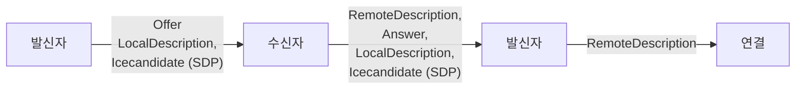

# 스터디 클럽 WEB-RTC


## 📝 프로젝트 개요
Web에서 N:N 다수의 사용자들과 화상 통화를 진행하거나,
연결된 P2P 데이터 채널을 통해 데이터를 교환하여 채팅 및 공용 보드의 낙서나 사진을 동기화합니다.
WebRTC 연결 과정을 NodeJs, Socket이 아닌 Http 메시지로 핸들링하고 싶었으며,
이벤트 지향성으로 확장성을 고려하여 시그널링 서버 및 클라이언를 맡았습니다.


## 🧩 프로젝트 의도 및 이점
### 스터디 클럽 WEB-RTC
- Web RTC를 알게 되어 흥미로운 기술이라고 생각하고, N:N 연결을 시도해 보았습니다.
- NodeJS 및 WebSocket을 사용하지 않고, HTTP 메시지 핸들링만으로 연결을 시도해 보았습니다.
- 리액티브 프로그래밍 이벤트 구독 발행 모델을 모방하여, 메시지 큐와 이벤트를 활용한 확장성 있는 구조를 의도해 보았습니다.
- 손쉬운 방 생성, 방 입장 API를 통해 프로젝트에 손 쉽게 부착하였습니다.

## 🛠️ 사용 기술
- 기술
  - JAVA
  - JAVASCRIPT
  - SPRING
- 라이브러리
  - WEB RTC
  
## 🔍 프로젝트 살펴보기
### RTC 시연
<br><br>
- WebRTC 두 클라이언트의 P2P연결 후 화면입니다.
데이터 채널을 통해 채팅 및
캔버스 메타 데이터를 전달 받으며
드로잉 선 & 커서 & 이미지 파일들을 동기화합니다.
<br><br>

<br><br>
- N:N 다수의 WebRTC 연결 모습입니다.
<br><br>

## 📋 구현 기능 
- 시그널링 서버
  - 이벤트 스트림 등록 API : SSE Event (Server Sent Event), 이벤트 핸들 API
  - 방 생성 API & 방 입장 API
  - 방 조회 API & 다수 방 조회 API
- 클라이언트
  - Web RTC N:N 연결 및 연결 후 P2P 데이터 채널을 통한
  - 화상 연결 & 채팅
- 캔버스 동기화 : 선 그리기, 선 색 변경, 화면 커서, 화면 지우기, 사진 객체
  - 백 버퍼 캔버스
- 방 버전 체크
- 이벤트 파이프라인
  
## 📝 WEB RTC SERVER 다이어그램
### WEB RTC 프로세스 플로우
- 발신자가 Offer 생성 및 로컬 정보 설정 시 발신자의 네트워크 후보들이 SDP인증서에 등록됩니다.
- 수신자는 발신자의 Offer를 수신하고, 원격 정보 설정 이후 Offer기반 Answer응답을 생성합니다.
- 이후 수신자는 마찬가지로 로컬 정보 설정 시 수신자의 네트워크 후보들이 SDP인증서에 등록되며,
- 이하 발신자가 SDP 인증서가 담긴 Answer를 응답받고 원격 정보 설정 시,
- 둘은 Connected 상태로 전환 되며, P2P 연결 상태가 됩니다.



### 흐름도 (서버)


#### SSEService
- SSEController를 통해 클라이언트에 SSEEvent 스트림을 등록합니다.
EventCapture를 통한 결과를 서버에서 클라이언트에게 메시지를 발송할 수 있게 됩니다.
  - autowire
  - EventCapture 구현체들을 의존 주입합니다.
  - OfferEvent구현체는 Offer, AnswerEvent구현체는 Answer.
    이벤트와 매칭 됩니다. 사용자에 의거 EventCapture 클래스가 확장 되어도,
    기존 코드를 수정 하지 않도록 Spring 의존 주입을 활용해 보았습니다.
     ```java
      @Service
      public class SSEService {
      
          private Map< String, Map< String, SseEmitter > > roomClientEmitters 
              = new ConcurrentHashMap<>();
          private Map< String, EventCapture > eventCaptureStore 
              = new ConcurrentHashMap<>();
      
          @Autowired
          SSEService(List< EventCapture > eventCaptures){
              eventCaptures.forEach(ec -> eventCaptureStore.put(getEventType(ec), ec));
          }
      
          private String getEventType(EventCapture eventCapture){
              String simpleName = eventCapture.getClass().getSimpleName().toLowerCase();
              int index = simpleName.indexOf("event");
              return simpleName.substring(0, index);
          }
      }

     @Component
      public class OfferEvent implements EventCapture{
          .
          .
          .
      }
    
      @Component
      public class AnswerEvent implements EventCapture{
          .
          .
          .
      }
     ```
  - publish
  - 클라이언트로부터 요청받은 HandleEvent를 발행합니다.
    클라이언트들을 순회 하며, EventCapture가 적합한 Event를 처리하여,
    클라이언트들에게 전달합니다.
  - 책임 및 처리를 EventCapture로 위임시켜,
    이벤트 확장에도 코드 수정이 없도록 디자인해보았습니다.
     ```java
      public void publish(HandleEvent handleEvent){
        .
        .
        Map clients = roomClientEmitters.get(roomUuid);
        clients.forEach( (targetClient, emitter) ->{
            doPublish(targetClient, handleEvent, emitter, clients);
        });
    }

    private void doPublish(String targetClient, HandleEvent handleEvent, 
        SseEmitter emitter, Map< String, SseEmitter > clients){

        String eventType = handleEvent.getEventType();

        if( eventCaptureStore.containsKey(eventType) ){
            EventCapture eventCapture = eventCaptureStore.get(eventType);
            eventCapture.doAction(targetClient, handleEvent, (data) ->{
                try {
                    emitter.send(data, MediaType.APPLICATION_JSON);
                } catch (IOException e) {
                    .
                    .
                }
            });
        }
    }
     ```
#### EventCapture
  - Event를 적합하게 처리할 인터페이스입니다.
  적합 구현체가 그 역할을 구현합니다.
    - JoinEvent
    - EventCapture 구현한 JoinEvent입니다.
      Join 발생 시 요청 클라이언트를 제외한 모든 클라이언트에게 메시지를 발송합니다.
       ```java
        @Component
        public class JoinEvent implements EventCapture{
        
            private final RoomService roomService;
        
            @Autowired
            public JoinEvent(RoomService roomService){
                this.roomService = roomService;
            }
        
            @Override
            public void doAction(String targetClient, HandleEvent handleEvent, 
                Consumer< RoomStateEventHandler > consumer) {
        
                if(!targetClient.equals(handleEvent.getClientUuid())){
  
                    HandleEvent data = new HandleEvent(handleEvent);
                    Room room = 
                        roomService.getRoomStore().get( handleEvent.getRoomUuid() );
        
                    RoomStateEventHandler roomStateEventHandler = 
                        new RoomStateEventHandler(room, data);
                    consumer.accept(roomStateEventHandler);
                }
            }
        }
       ```
## 📝 WEB RTC CLINET 다이어그램
### 프로세스 플로우
- 서버로부터 Event를 받으면 BeatSync를 통해 방에 대한 정보 및 버전을 업데이트합니다.
- 해당 이벤트를 MsgQueue Pipe에 발행합니다.
- Pipe는 PipeChain으로 부터 진입 시 필터를 거치고 발행 시 특정 로직을 처리하며,
- 처리 결과가 시그널링 서버로 전송됩니다.
